 

 

## 👋 About me

- 🏢 **Founder & lead developer at Nork Studio** — I design and build software products end-to-end: architecture, backend, UI, mobile, deployment.
- 🏗️ **Domain: construction & real estate.** Years inside large development projects turned into software that runs project control, cost analysis, document flow and CRM for a developer company.
- 📱 **Nork Due** — a minimalist payments calendar for Android. Glass UI, offline-first, no trackers, no ads.
- 🤖 **Bots & automation** — Telegram bots, content schedulers, browser automation, data pipelines.
- 🧠 **Local AI studio** on a single GPU — image & video generation, upscaling, speech-to-text, OCR with vision models. Fully offline.
- 🔒 Most repositories here are **private by design** — happy to show them in a call.

## 🧰 Stack

  

## 🛠️ What I build

| | Area | What's inside |
|---|---|---|
| 🏢 | **Ecosystem for a developer company** | A multi-module platform for a real-estate developer: project control with Gantt & dependencies, technical-economic calculations, document analysis with OCR, CRM, role-based access and corporate auth. Desktop + web + Android, on-prem deployment. |
| 📱 | **Nork Due** | Android app — a calendar of recurring payments. Kotlin + WebView, glassmorphism UI, local notifications, zero internet permissions. Heading to Google Play. |
| 🤖 | **Bots & pipelines** | Telegram bots for content automation, scheduled reposts, browser bots for public registries, Excel/Word report generators. |
| 🎨 | **Local AI tools** | ComfyUI workflows (SD / Wan video), ×2 upscaling with detail generation, Whisper large-v3 transcription, VLM-based scan-to-text — one-click desktop utilities. |

## 📫 Contact

*The best way to reach me is right here on GitHub.*

 

